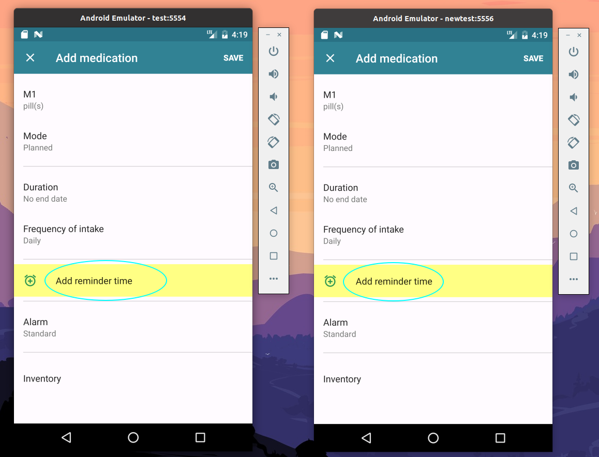
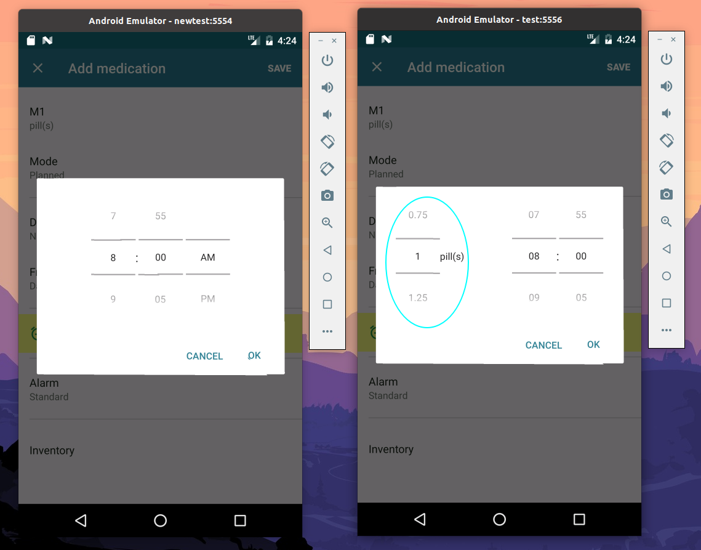

选取的 APP 基准版本和升级版本的列表

| APP              | CATEGORY        | BASE_VERSION | UPDATED_VERSION |
| ---------------- | --------------- | ------------ | --------------- |
| Dianping         | Food            | 10.18.4      | 10.26.32        |
| Google Drive     | Productivity    | 2.19         | 2.2             |
| Google Kids      | Kids            | 5.34.3       | 5.36.5          |
| Greetings Island | Event           | 1.1.19       | 1.1.40          |
| Lark Player      | Music           | 4.12.7       | 4.13.3          |
| Myztherapy       | Medical         | 3.31.1       | 3.33            |
| Pinterest        | Lifestyle       | 8.40.0       | 8.45.0          |
| ReadEra          | Book            | 20.07.30     | 20.12.17        |
| Reface           | Entertainment   | 1.0.25.2     | 1.7.3           |
| Wallli           | Personalization | 2.8.1        | 2.8.3           |
| HD Camera        | Photography     | 1.0.4        | 1.1.0           |

**选取基准**：

> 鉴于论文阐述较为宽泛，工具实现的细节有些地方没有交代到位，因此初步实现时暂先选取界面较为简单、包含测试动作较少的应用，若后续有兴趣可继续完善工具，尝试修复更复杂的脚本及应用。

**注1**：

> 软件安装包会占用较大空间，由于网速和受限的原因，git到github时速度很慢，检查时clone下来也会比较麻烦，因此软件对应版本安装包没有存放在仓库中。附<a href=https://m.apkpure.com/>下载地址</a>。

**注2**：

> 由于初次接触移动自动化测试，对安卓和Appium使用尚不熟练，选取实验样本时测试序列较短。如：
>
> ```python
> # -*- coding:utf8 -*-
> 
> import time
> from appium import webdriver
> from selenium.webdriver.common.by import By
> 
> desired_caps = {'platformName': 'Android', 'platformVersion': '7.0', 'deviceName': 'emulator-5554', 'appPackage': 'eu.smartpatient.mytherapy', 'appActivity': '.onboarding.WelcomeActivity', 'newCommandTimeout': '1000', 'noReset': True}
> 
> driver = webdriver.Remote('http://0.0.0.0:4723/wd/hub', desired_caps)
> time.sleep(20)
> 
> # reminder time
> el = driver.find_elements(By.CLASS_NAME, "android.widget.Button")[4]
> el.click()
> 
> driver.quit()
> 
> '''
> {
>   "platformName": "Android",
>   "platformVersion": "10",
>   "deviceName": "emulator-5554",
>   "noReset": true,
>   "appPackage": "eu.smartpatient.mytherapy",
>   "appActivity": ".onboarding.WelcomeActivity"
> }
> '''
> ```

​	这段测试脚本是针对应用 "Myztherapy" 设计的，这款APP是医疗类的应用，用户可以通过设定服药提醒、运动提醒等方式辅助疾病疗愈。这段脚本针对的是服药提醒，见下图。（左图为旧版本，右图为新版本）



​	因此，取 <code>driver.find_elements(By.CLASS_NAME, "android.widget.Button")</code> 即找到屏幕中第5个按钮（下标从0开始）并点击之，新界面如下：



​	可以看出，新版本将每次服用药物的计量合并到了服用时间选择框中。本次工作针对的都是类似这样的两个页面间的1～2个动作，但即使如此，运行时间仍然很长。