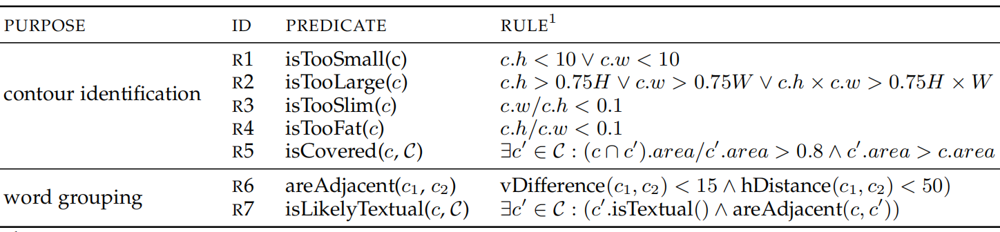
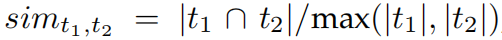
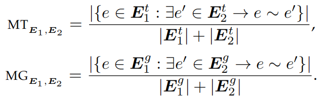
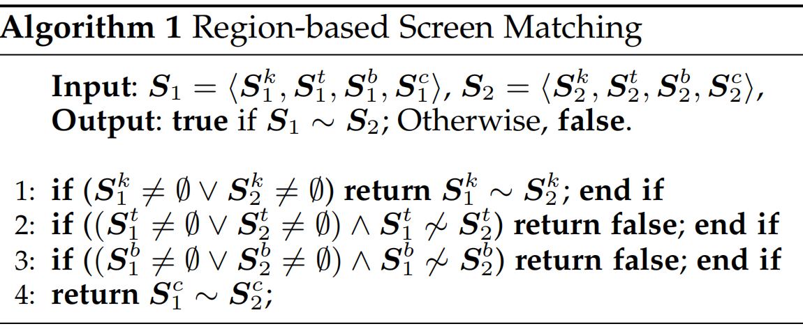
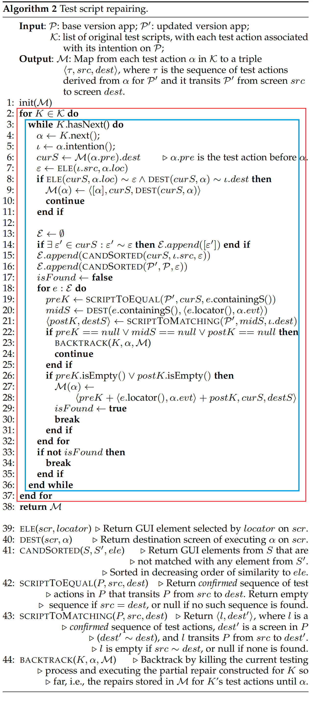
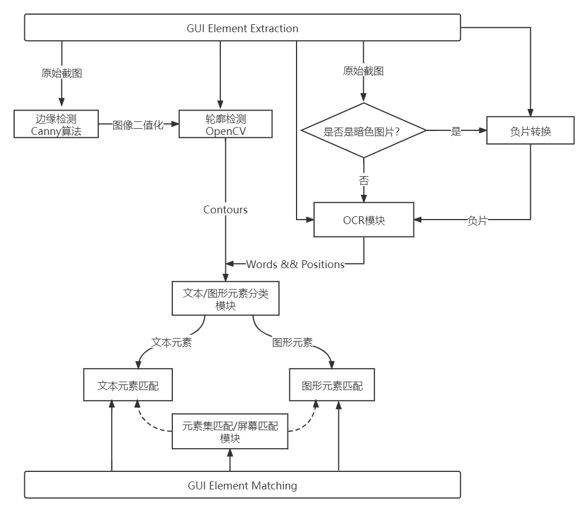

## 工具理解

### I. GUI Matching

判断两个测试脚本执行结果是否相互一致

- 依据：源screen和目标screen之间的关系以及关于移动应用GUI性质的一些*规则*（后面补充）

  > screen：用户可见的GUI界面

1. GUI Element Extraction

   - 从截图中提取GUI元素

     - 首先通过*轮廓检测*来识别GUI元素的边界
     - 然后通过字符识别将GUI元素分类为文本或图形

   - 轮廓检测：

     - 采用一种叫轮廓检测（contour detection）的CV技术检测GUI元素可能的便捷，如按钮、文本框等，并基于一系列预先定义的规则滤掉不大可能的边界

     - 具体来说，采用 *Canny algorithm* 检测边缘的初始集合，然而检测到的轮廓并不一定是真实的GUI元素轮廓（例如截屏中有一段话，希望检测到每个单词的轮廓，但此算法只会对每个字符进行轮廓提取），为了解决这个问题，***将检测到的边的厚度增加到三倍，使得单词中的字符边缘相交，而单词之间不会相交***。然后，在扩大的边缘上使用已实现的检测算法（*G. R. Bradski and A. Kaehler, Learning OpenCV - computer vision with the OpenCV library: software that sees. O’Reilly, 2008.*）获取边缘。

     - 通过一系列规则过滤掉不可能的边缘，规则见下：

       

       其中R1~R4分别用于识别太小、太大、太瘦、太胖的GUI元素，满足这四个中任意一个的GUI元素认为是GUI元素的不正常边界，被踢掉。

       假设GUI测试只和可触发的GUI元素有关（可交互元素）且可触发元素之间不会重叠，R5用于识别大部分区域被另一个更大轮廓所覆盖的轮廓，并且只会保留重叠轮廓中最大的那个轮廓。

   - 文本元素和图形元素划分

     - 得到轮廓后，接下来把GUI元素进行划分，使用***OCR技术***（光学字符识别）。使用***微软的API（MSCVA）***从截屏中识别文本，通过检查识别轮廓的位置和大小是否和提取的文本相匹配，来决定元素是文本还是图形。
     - 需要对MSCVA进行一些调整，例如它无法处理文本颜色比背景颜色更浅的图像，这也是移动应用常见的情况：许多app可以调为夜间模式，深色背景上的文本必然是浅色。在这种情况下，在把图像发送给MSCVA做OCR之前，首先计算图像所有像素点的RGB值，如果平均RGB值小于一个阈值（***经验上默认为150***），则认为图像是暗色的，那么将图像转为其负片，即***每个像素点从(r,g,b)转为(255-r,255-g,255-b)***，然后再传给MSCVA。否则直接将原图传出。

   - 经过以上处理后，获得了截屏中的大部分单词，为了匹配不同截屏的元素，就需要和获取每个元素上的完整文本（即元素文本 element text）。METER通过连接来自相邻GUI文本元素的单词（即元素之间垂直位置相近，或之间的水平距离较小）重新构建元素文本。判定“相邻GUI元素”的规则是下表R6.

     

     R6本身是不够的，因为技术限制，MSCVA可能识别不出某些单词，从而把包含这些单词的元素文本切碎。为了解决这个问题，引入R7搜索轮廓，如果轮廓对应于文本，则会用于形成更大的元素文本块。如果没有检测到对应于文本的轮廓，则使用虚拟单词“placeholder”占位。虚拟单词可以帮助构建元素文本，但本身没有含义，当计算两个元素文本的相似度时也不会考虑在内。

2. GUI Element Matching

   提取GUI元素并分类后，进行比较GUI元素，看看它们彼此是否匹配。

   - 文本元素匹配：基于两文本元素间对应文本的相似度
     - 给定两个文本元素e1，e2，设t1和t2分别为这两个元素的非占位单词的集合，t1和t2之间的相似度为，如果该值大于等于一个阈值，则认为e1和e2相匹配。阈值默认取0.4，因为两个原因：许多文本元素只包含几个单词，两个元素间即使只有一个单词不同也会导致sim值很小，把阈值设太大不符合实际；开发者往往会将不同元素的文本设为不同，减少用户混淆，这会导致不同元素之间文本相似度较小，把阈值设太小会导致匹配到无关联文本。
   - 图像元素匹配：移动app中使用的图标等通常作为资源文件单独组织，这些图标一般会重定位、大小有变、或产生旋转，很少以其他方式变化。
     - METER采用一种叫做SIFT（尺度不变特征变换）的CV技术从截屏图像中提取特征描述符，基于两个图像共有的特征描述符的数量来衡量两图的相似度。SIFT特征描述符对均匀的尺度和方向来说是不变的，因此METER在识别图像元素关联度时成功率较好。
     - 如果匹配特征描述符大于预定义的阈值$V_{gm}$，则认为两图相匹配。考虑到大多数移动应用的图标都很简单，包含的特征描述符较少，因此默认将阈值设为40%

   给定两个同类型（同为文本元素或同为图像元素）GUI元素e1，e2，使用 $e_1\sim e_2$ 表示二者匹配

3. Matching of GUI Element Collection

   将元素间匹配扩展到元素集间匹配，给定 $E$ 为GUI元素的集合，用 $E^t$ 和 $E^g$ 表示 $E$ 中的文本元素集和图像元素集，设 $E_1\ E_2$ 为两个GUI元素集合，则 $E_1\ E_2$ 间匹配的文本元素比例 $MT$ 和匹配的图形元素比例 $MG$ 可表示为：

   

   记 E1,E2 相匹配为 $E_1 \sim E_2$，其充要条件是：

   ​	1）$MT_{E_1,E_2}>V_{cm1}$ **或**

   ​	2）$MG_{E_1,E_2}>V_{cm1}$ **或**

   ​	3）$MT_{E_1,E_2}>V_{cm2}\ \and\ MG_{E_1,E_2}>V_{cm2}$

   其中两个阈值 $V_{cm1}=0.7,V_{cm2}=0.4$

   对于规模很小的元素集，只有很少的文本和图形元素，一两个非匹配元素就可能导致 MT 和 MG 在前两个条件中值小于 $V_{cm1}$，第三个条件作为补偿，允许小规模元素集之间相匹配，前提是MT和MG值是平衡的

4. Screen Matching

   基于screen上的GUI元素关联关系决定两个screen是否匹配。由于移动应用的screen接收用户输入时通常被分为优先级不同的区域，METER采用一种基于区域的方法进行screen匹配。

   - METER将屏幕区域分为三种：块区域（blocking region）、背景区域（background region）和内容区域（content region）。

   - 块区域对应覆盖窗口、抬出对话框和侧滑菜单等，覆盖窗口经常会覆盖当前屏幕区域的一部分。METER应该能够正确识别截图中的块区域。目前能够识别三种覆盖窗口：对话框、左滑菜单、右滑菜单。

     - 识别块区域的方法：将监测到的轮廓及其灰度分布与一组和不同类型覆盖窗口相关的预定义的pattern进行对比。例如要检测弹出对话框时，找到位于屏幕中心的轮廓，该轮廓灰度分布和屏幕其余部分的分布明显不同，METER在一个截屏中最多能识别一个块区域。

   - 背景区域对应于不同屏幕上通常相同的部分，例如屏幕上端或下端通常用于导航栏、标签栏等。假设这些区域在不同屏幕之间保持不变，METER在屏幕匹配时并不会将这些区域视为同等重要。

     - METER首先寻找屏幕顶部/底部高度20%、和屏幕等宽的轮廓，然后将将这些轮廓的最小边界框视为描绘背景的区域。对于每个截屏，METER最多能检测出顶部和底部的一个背景区域。

   - 没有被块区域和背景区域覆盖的区域，则称为内容区域，给定屏幕 $S$，METER总是试图识别 S 中不同的区域：

     ​	1）块区域 $S^k$

     ​	2）顶部背景区域 $S^t$

     ​	3）底部背景区域 $S^b$

     ​	4）内容区域 $S^c$

     每个识别的区域用该区域的文本和图形GUI元素集合来表示，屏幕中没有显示的区域使用 *∅* 来表示。当且仅当两个GUI元素集合相匹配时，两个区域相匹配。

     - METER通过算法 1（下图）决定两个屏幕 S1,S2 是否匹配（记为 S1~S2）

       

       1. 如果有一个屏幕中的区域包含块区域，当且仅当其他屏幕中也含有块区域并且两个块区域相匹配时，两个屏幕才匹配（第1行）
       2. 如果两个屏幕都没有块区域，但一个屏幕中的背景区域在另一个屏幕上没有匹配，两个屏幕不匹配（第2/3行）
       3. 如果两屏幕都没有块区域，且它们的背景区域相匹配，当且仅当它们的内容区域匹配时，这两个屏幕匹配（第4行）

### II. Test Script Repair

1. 先验知识

在这一部分，使用 $<loc,evt>$对 表示测试行为 $\alpha$，其中 loc 是元素定位符，用于定位屏幕中一个特定GUI元素的位置，evt 是当 $\alpha$ 执行时触发的事件。将一个测试脚本定义为一个序列 $K=\alpha_1,\alpha_2,\cdots,\alpha_n$，其中 $\alpha_i$ 是测试执行动作。

- 在屏幕 S 上执行测试动作 $\alpha=<loc,evt>$ 时，首先需要应用定位符 loc 以识别 S 上交互的目标GUI元素，然后在该元素上触发事件 evt。若测试动作成功执行完毕，应该将应用转化到一个（可能不同的）目标屏幕上。
- 记由 $\alpha$ 的成功执行而导致的屏幕转换为 $<src,dest>$对，该对可以表示测试动作的预期动作，称此转换过程为测试动作的 ***意图（intention）***。记转化过程 $\tau=<src_1,dest_1>$ 和一个 ***意图*** $\iota=<src_2,dest_2>$，当且仅当 $src_1\sim src_2\ \and\ dest_1\sim dest_2$ 时（即源屏幕和目标屏幕各自匹配时），我们说转换 $\tau$ 和意图 $\iota$ 匹配，记为 $\tau \leadsto \iota$

2. Repair Test Script Construction

   Algorithm 2 展示了METER是如何一步步修复测试脚本的。注意在修复过程中，METER总会重用一个测试动作，前提是测试动作的意图在新版应用上得以保留，并且只会在必要时才会产生新测试动作序列。

   - 整个流程包含两个嵌套循环

     - 外层循环遍历 $\cal{K}$ 中每个测试脚本Ｋ，为新版本应用Ｐ＇构建一个新的测试脚本Ｑ作为修复结果（2~37行）

     - 内层循环遍历每个测试脚本Ｋ中的每个测试动作 $\alpha_i$，获得一个测试动作序列 $q_i$ 使得：

       ​	1）测试脚本[q1,q2,...,qi]成功地在新版本应用Ｐ＇上执行（这里[q1,q2,...,qi]表示将序列 q1 到 qi 连接起来所产生的测试脚本）

       ​	2）在Ｐ＇上由 $q_i$ 导致的屏幕***转换***和测试动作 $\alpha_i$ 在Ｐ上的测试***意图***相匹配（3~36行）

   - 如果METER没有成功为Ｋ中的测试动作 $\alpha_j$ 建立一个测试动作序列 $q_j$，会立刻返回一个序列 $Q=[q_1,q_2,...,q_{j-1}]$ 作为 Ｋ 的修复结果

   

   - 更具体来讲，意图 $\iota$ 是当前动作 $\alpha$ 的意图，每次构建一个 $curS$，即上个测试动作的目标屏幕，要和第5行的 ***意图*** $\iota.src$ 相匹配。设 $\varepsilon$ 为动作 $\alpha$ 在 $\iota.src$ 屏幕上相交互的GUI元素

   - METER首先在 curS 上按原样执行 α，如果 α 仍可执行，且其意图得以保留（即 α.loc 定位的GUI元素也可以在 curS 上找到，且 α.evt 触发的事件仍会在 P' 上转换到目标屏幕上，与 $\iota.dest$ 相匹配），则 α 直接在修复的测试脚本中重用即可。（8-11行）

   - 若 α 在 P' 上没有保留原本意图，METER就需要构建一系列测试脚本作为 α 的修复结果，在此过程中，METER假定应用程序功能正常，相应的GUI元素在版本升级后没有移除，因此总会试图在 P' 中寻找一个GUI元素 $e$ 对应原版本中相应的元素 $\varepsilon$。当元素 $e$ 在屏幕 curS 上执行时，会满足两个条件：

     ​	1）元素e上会触发事件 α.evt

     ​	2）元素e会把应用 P' 转换到目标屏幕，该目标屏幕匹配于 $\iota.dest$，并希望后续测试动作不受影响

     - 为了识别元素 $\varepsilon$ 对应的 P' 中的元素 $e$，METER遍历一个 P' 中已排序的候选元素的集合 $\cal{E}$。如果在 curS 中存在一个元素 $\varepsilon'$ 和 $\varepsilon$ 相匹配，则将 $\varepsilon'$ 视为有最高优先级的候选元素并将其添加到 $\cal{E}$ 中（第14行）。来自 P' 的元素中，有一些不会和 P 中的元素相匹配，但也会被视为候选元素，只不过优先级更低（第15,16行）。
     - 给定 P' 中的一个屏幕 S'，设 P 中与之匹配的屏幕为 S，记 S' 中不与 S 中任意元素相匹配的元素集合为 $\delta_{S'}$，则 $\delta_{S'}=\{e|e\in E'\ \and \ \nexists e'\in E:e\sim e'\}$，其中 E' 和 E 分别是 S' 和 S 中的元素集合。
       - 若 S' 不和 P 中任意屏幕匹配，$\delta_{S'}$ 和 E' 相等。
       - 注意：既然GUI元素的修饰可以是任意的，METER在这一步中并不要求候选元素和 $\varepsilon$ 相似。并且在检查全局元素（即 P' 其他屏幕中的候选元素）前，METER会检查所有局部候选元素（即curS中的候选元素），以保证优先进行局部匹配

   - 对每个 $e\in\cal{E}$，METER试图：

     1）建立一个测试动作序列 preK，将 P' 从 curS 导航到包含元素 e 的那个屏幕中（第19行）

     > scriptToEqual() 方法和 scriptToMatching() 方法用于构建将 P' 中 S1 转换到 S2，METER在此过程中经历了三个步骤：
     >
     > 
     >
     > :one: 从P中分别识别出 S1 和 S2 相匹配的屏幕 Sa 和 Sb
     >
     > :two: 构建一个能将 P 从 Sa 转换到 Sb 的测试动作序列的列表 $\Gamma$
     >
     > :three: 动态验证 $each\ \gamma\in\Gamma$，找到其中能真正实现 P' 上从 S1 转换到 S2 的序列 $\gamma_i$
     >
     > 步骤:two:中序列列表的构建是基于：给定两个 P 的测试动作 α1 和 α2，以及他们的意图 $\iota_1$ 和 $\iota_2$，如果 $\iota_1.dest\sim\iota_2.src$，那么执行序列 α1，α2 可能就会将 P 从 $\iota_1.src$ 转换到 $\iota_2.dest$.
     >
     > 
     >
     > METER可以建立一个图 $\cal{G_P}$，顶点是屏幕，边是意图（模拟 P 的可能行为），给定两个屏幕 Sa,Sb 作为源和目的，一个（广度优先）搜索被执行，以找到图中连接 Sa 和 Sb 的边的集合。METER可以通过将意图映射到测试动作来获取可能将 P 从 Sa 转换到 Sb 的测试动作序列。
     >
     > 
     >
     > 步骤:three:中动态验证的过程是必要的

     2）在 e 上触发 α.evt，并将 P' 转换到另一个另一个屏幕 midS 上（第20行）

     3）构建另一个测试动作序列 postK，将屏幕从 midS 导航到和 $\iota.dest$ 相匹配的屏幕 destS（第21行）

     - 在这里，preK 和 postK 的构建涉及到在先前 P' 上执行测试时观察到的屏幕转换关系，以找到最短测试动作序列，并基于这个测试序列是否达到了预期屏幕转换来返回此序列或直接返回 null

     - 如果第22行中涉及到的任意一个步骤失败（preK==null 或 midS==null 或 postK==null），则构建的过程立即失败。此时，为了撤销已尝试的测试动作序列可能导致的改变，METER通过杀死当前测试进程并执行目前已经为 K 构建的部分脚本修复序列（即 $\cal{M}$ 中存放的修复动作序列）来回退到curS中（第23行）

     - 否则，将 preK，<e.loc, α.evt> 和 postK 连接起来，构建满足***先前提到的两个条件***的测试动作序列。

       > 1）元素e上会触发事件 α.evt
       >
       > 2）元素e会把应用 P' 转换到目标屏幕

   - 如果构建出的序列足够简单，也就是说 preK 或 postK 存在空的序列（第26行），METER就会把此序列作为 α 的修复（第28行）；否则，认为对 α 的修复失败，在开始修复下一个测试脚本之前，METER返回构建的测试动作序列作为K的修复结果（第33,34行）。

### III. METER Implementation

- 使用 Appium test automation framework 驱动移动应用
- 依赖于 Appium Python Client library 运行用python写的测试脚本
- 对于轮廓检测和 OCR，METER使用 OpenCV library（version 3.1）和 Microsoft Azure OCR API（实际中采用百度OCR接口）

### IV. Data Flow Diagram

